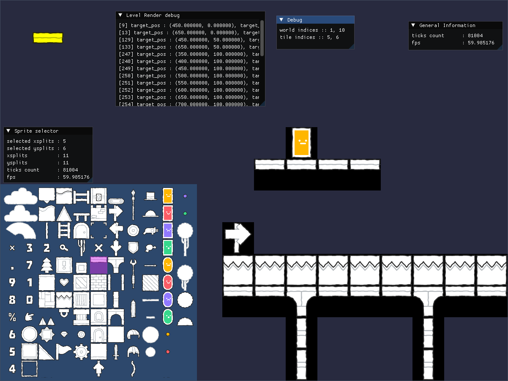
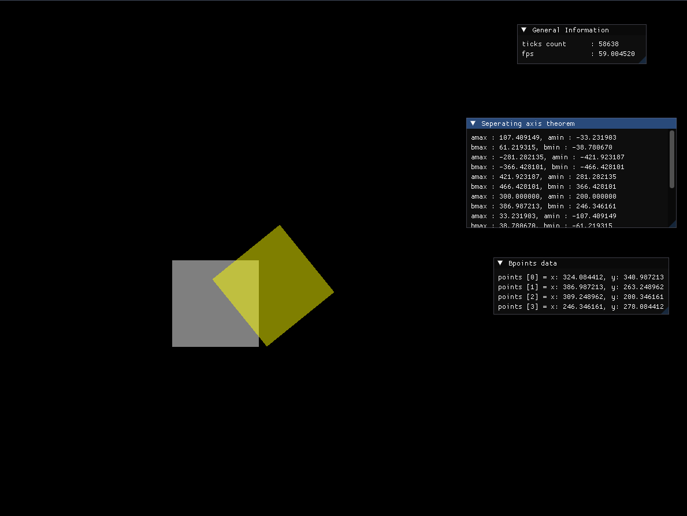

# Bread

A 2D Game Engine &amp; Game written completely from scratch using SDL2 &amp; Opengl (with GLEW for extensions, and ImGUI for Immediate UI library used in debugging and testing) 

## Progress 

We now - 

1. Have inbuilt tile editor
2. Have simple physics collisions
3. Have hot code reloading to quick iterative testing

## Sprite based editing

We have a single sprite sheet supported tile mapping 

## Physics Collisions

We have a simple 2D collision detection implemented (using seperating axis theorem, not the most efficient but will do for now)

